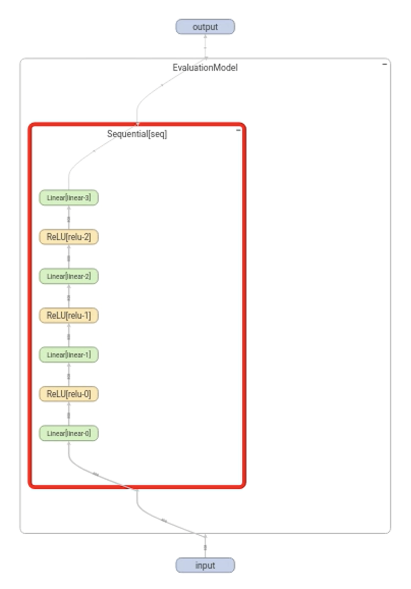
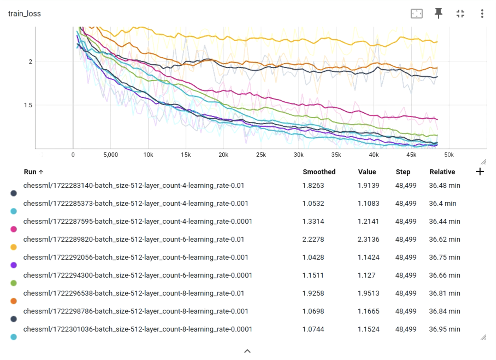
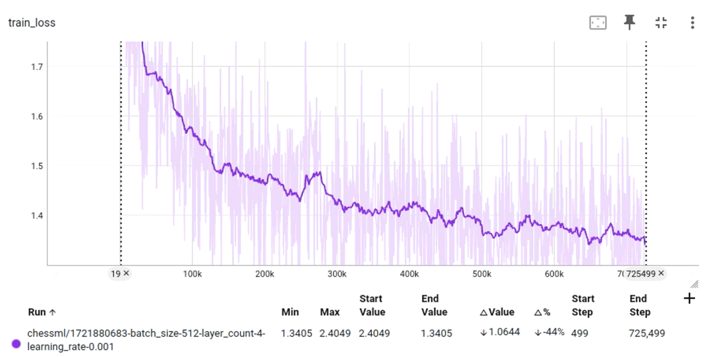

# ai-chess-bot

## Overview
Project to apply a deep neural network to learn a chess position evaluation function from labeled lichess.com position examples and use the result to play live chess.

Only the evaluation function learning component is currently implemented in this repository. Move generation and move selection, possibly including minimax, alpha beta pruning, etc. would be necessary to complete a playable bot for live chess.

## Training Method

The network is trained on a [Lichess Standard Chess open database files](https://database.lichess.org/) which represent games in [Portable Game Notion](https://en.wikipedia.org/wiki/Portable_Game_Notation) and some proportion of them include the traditional Stockfish chess engine's evaluation, showing white or black's advantage in centipawns for the given position.

These PGNs are converted into [bitboard](https://www.chessprogramming.org/Bitboards) representation for each piece type, along with some other relevant information, and the ([bitboards], eval()) tuples are used as labeled inputs for the neural network, which is implemented in PyTorch Lighting.

## Model Architecture

The model structure includes an 808 element input layer, which receives the concatenated piecewise bitboard representations of the position under consideration along with some other board/game state information.

There are a configurable number (tested from 4-8) of hidden layers with ReLU activation enabled.

The output layer consists of a single floating point output element which represents the model's estimated evaluation for the given input position.

### Model

## Training Results
An initial hyperparameter sweep was used to determine optimal hyperparameters. Batch size was was initially determined to have little effect on the rate of improvement, so it was fixed at 512. The sweep was then conducted to find optimal values for network layer count and learning rate. The sweep results were visualized using TensorBoard.

### Training Loss for Hyperparameter Sweep 

### Multi Epoch Training Run 
With a batch size of 512, a layer count of 4, and a learning rate of 0.001, a 725k step run resulted in an end of run loss value of 1.3405.

Code derived from the Towards Data Science blog post [Train Your Own Chess AI](https://towardsdatascience.com/train-your-own-chess-ai-66b9ca8d71e4).
